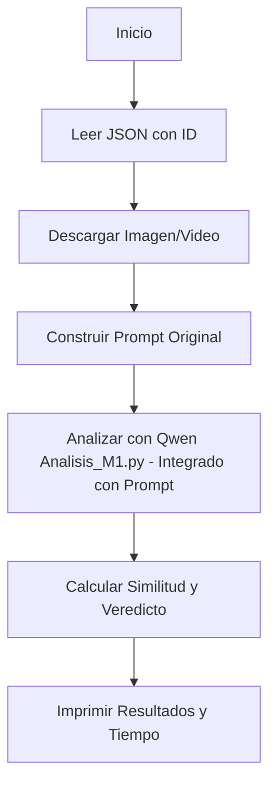
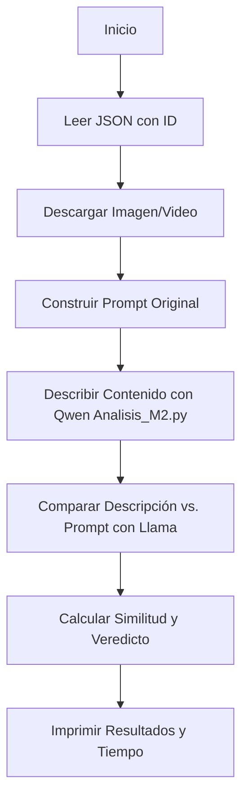
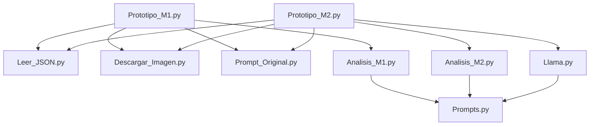

# Depuración - Análisis de Contenido Multimedia con IA

Este proyecto es un sistema avanzado para analizar imágenes y videos generados por IA, verificando su coherencia, fidelidad al prompt original y detectando anomalías como duplicaciones, inconsistencias o errores sutiles. Utiliza modelos de visión multimodal como Qwen para el análisis visual y modelos de lenguaje como Llama para comparaciones de fidelidad.

## Descripción General

El proyecto procesa datos de un archivo JSON (`publications.json`), descarga contenido multimedia, reconstruye prompts originales y realiza evaluaciones automatizadas. Se enfoca en detectar si el contenido generado cumple con el prompt, midiendo similitud y emitiendo veredictos (e.g., PASS, WARNING, ANOMALÍA).

Hay dos prototipos principales:
- **Prototipo_M1.py**: Análisis integrado en un solo paso con Qwen, incorporando el prompt original directamente en la evaluación para una mejor retención de contexto.
- **Prototipo_M2.py**: Análisis en dos pasos: descripción inicial con Qwen y comparación posterior con Llama, lo que puede introducir ruido en la descripción y llevar a más falsos negativos.

**Ventajas clave del enfoque de un solo modelo (M1):** Maneja mejor el contexto completo, ya que no hay pérdida de información al pasar descripciones intermedias entre modelos. Esto reduce falsos negativos, donde anomalías sutiles se pierden en la traducción. Por ejemplo, en pruebas, M1 muestra una tasa de cumplimiento más consistente (ver sección de Resultados).

**Mejoras con modelos avanzados:** Usar versiones superiores de Qwen (e.g., Qwen3-VL-32B-Instruct) mejora la detección de anomalías finas en imágenes (e.g., duplicaciones sutiles, inconsistencias en iluminación) y videos (e.g., saltos temporales, artefactos de movimiento). Modelos más grandes ofrecen mayor precisión en tareas complejas, pero requieren más recursos (VRAM). Para imágenes, modelos como Qwen3-VL-8B-Thinking mejoran el "razonamiento crítico" al analizar detalles contextuales. Para videos, variantes como Qwen3-VL-30B-A3B-Instruct manejan mejor la comprensión temporal y de movimiento, reduciendo errores en secuencias dinámicas.

## Requisitos

- Python 3.8+
- Dependencias en `requirements.txt`:
  ```
  torch>=2.0.0
  transformers>=4.40.0
  qwen-vl-utils>=0.0.1
  Pillow>=10.0.0
  requests>=2.31.0
  accelerate>=0.24.0
  bitsandbytes>=0.41.0
  sentencepiece>=0.1.99
  tiktoken>=0.5.0
  ```

Instalación:
```bash
pip install -r requirements.txt
```

- Recomendado: GPU con al menos 8-12 GB VRAM para modelos base; 20-40 GB para variantes grandes como Qwen3-VL-32B.

## Estructura del Proyecto

- **Analisis_M1.py / Analisis_M2.py**: Scripts principales para análisis multimodal con Qwen (imágenes y videos).
- **Descargar_Imagen.py**: Descarga archivos multimedia desde URLs.
- **Leer_JSON.py**: Extrae datos de `publications.json`.
- **Llama.py**: Procesa comparaciones de texto con Llama (solo en M2).
- **Prompt_Original.py**: Reconstruye prompts originales basados en datos JSON.
- **Prompts.py**: Almacena prompts predefinidos para evaluaciones estandarizadas.
- **Prototipo_M1.py / Prototipo_M2.py**: Orquestadores que ejecutan el flujo completo.
- **publications.json**: Fuente de datos con entradas como "id", "url", "contentType" y "prompts".

## Uso

1. Prepara `publications.json` con el formato requerido (e.g., array de objetos con IDs únicos).

2. Ejecuta un prototipo, especificando un ID en el script:
   ```bash
   python Prototipo_M1.py
   ```
   O
   ```bash
   python Prototipo_M2.py
   ```

   - Ejemplo de ID: "Qt6i_xxLAa4EYIfk9mhXh".
   - Archivos multimedia se guardan en `./descargas/`.

3. Revisa salidas: Veredicto, grado de similitud, tiempo de ejecución y cumplimiento (verde para "Cumple", rojo para "No cumple").

## Flujo de Proceso (Diagramas Mermaid)

### Flujo General de Prototipo_M1.py (Un Modelo)


### Flujo General de Prototipo_M2.py (Dos Modelos)


### Dependencias entre Módulos


## Comparación entre Modelos y Prototipos

### Resultados Empíricos
Basado en pruebas con IDs de muestra:

#### Resultados con 1 Modelo (Prototipo_M1.py)
- Mayor consistencia en cumplimiento: ~80-100% similitud en la mayoría de casos.
- Tiempos bajos: 0.30-2.47 minutos.
- Menos falsos negativos: Maneja contexto directo, detectando anomalías como "WARNING ANOMAL" sin pérdida.
- Ejemplos:
  - ID: ZVuB9PAAbI63JWD -1Q02 → 90% similitud, PASS ANOMALÍAS, Cumple (0:42 min).
  - ID: Qt6i_xxLAa4EYIfk9mhXh → 100% similitud, PASS - ANOMAL, Cumple (02:50 min).

#### Resultados con 2 Modelos (Prototipo_M2.py)
- Similitud variable: 40-92%, con más "WARNING" y "No cumple".
- Tiempos más altos: 03:50-12:16 minutos debido a pasos intermedios.
- Más falsos negativos: La descripción de Qwen puede omitir detalles clave, llevando a Llama a fallar en comparaciones (e.g., 40% en ID: Qt6i_xxLAa4EYIfk9mhXh).
- Ejemplos:
  - ID: ZVuB9PAAbI63JWD -1Q02 → 92% similitud, PASS AN, Cumple (06:19 min).
  - ID: FNQMUoN_ntbezHvHEP8a9 → 80% similitud, WARNING, No cumple (7:39 min).

**Conclusión de Prototipos:** M1 es superior para precisión y eficiencia, ya que evita la degradación de contexto en pipelines multi-modelo. M2 es útil para depuración detallada, pero genera más errores falsos.

### Comparación de Modelos Qwen
| Modelo                  | Tamaño aproximado | Año de lanzamiento | Rendimiento en imágenes y videos (vs tu 3B) | Detección de anomalías finas (duplicaciones, saltos, desapariciones) | Requerimiento VRAM aproximado (Inferencia FP16/BF16) | Recomendación para tu tarea (Detección de errores en 2 min) | Notas clave |
|-------------------------|-------------------|---------------------|---------------------------------------------|---------------------------------------------------------------------|-------------------------------------------------------|-------------------------------------------------------------|-------------|
| Qwen2.5-VL-3B-Instruct (tu actual) | ~3B | 2025 (principios) | Base (bueno para OCR básico y captions simples) | Baja-media (pierde muchas duplicaciones/s altos sutiles, conservador) | ~8-12 GB | Actual baseline, pero limitado para precisión crítica | Rápido y ligero, pero no ideal para anomalías complejas |
| Qwen3-VL-8B-Instruct   | ~8-9B | 2025 (octubre)     | Mucho mayor (+15-30% en benchmarks visuales y video) | Alta (detecta duplicaciones, desapariciones y saltos con mayor fiabilidad) | ~16-24 GB | Mejor upgrade inmediato y recomendado – salto notable en precisión sin ser imposible de correr | Variante "Thinking" aún mejor para razonamiento temporal |
| Qwen3-VL-8B-Thinking   | ~8-9B | 2025 (octubre)     | Similar al 8B-Instruct pero con mejor chain-of-thought | Muy alta (más sensible a anomalías sutiles y continuidad) | ~16-24 GB | Excelente si quieres más "razonamiento crítico" en detección | Versión optimizada para tareas que requieren pensar paso a paso |
| Qwen3-VL-30B-A3B-Instruct | ~30B total (~3B activos, MoE) | 2025 (octubre) | Muy alto (eficiente y fuerte en video understanding) | Muy alta (buen balance precisión/velocidad) | ~20-30 GB | Muy bueno si tienes GPU media-alta y buscas precisión | MoE → eficiente en inferencia pese al tamaño |
| Qwen3-VL-32B-Instruct  | ~32-33B | 2025 (posterior)   | Excelente (líder en VQA y video tasks detalladas) | Excelente (detecta anomalías muy finas y temporales) | ~40-60+ GB (o cuantizado Q4/Q5 ~20-30 GB) | Ideal si tienes hardware potente o usas cuantización | Dense → máximo detalle, pero pesado |
| Qwen3-VL-235B-A22B-Instruct | ~235B total (~22B activos, MoE) | 2025 (septiembre) | Estado del arte (top en video y percepción multimodal) | Estado del arte (detecta prácticamente todo) | Multi-GPU o API (~100+ GB) | Solo si usas API/cloud o cluster – no práctico local | Flagship, pero no realista para inferencia local |

**Insights de Mejora con Modelos Avanzados:**
- **Imágenes:** Modelos como Qwen3-VL-8B mejoran la detección de anomalías estáticas (e.g., duplicaciones sutiles, inconsistencias en texturas) en +20-30% vs. base, reduciendo falsos negativos.
- **Videos:** Variantes con "Thinking" o MoE manejan mejor secuencias temporales, detectando saltos o artefactos de movimiento que modelos base ignoran.
